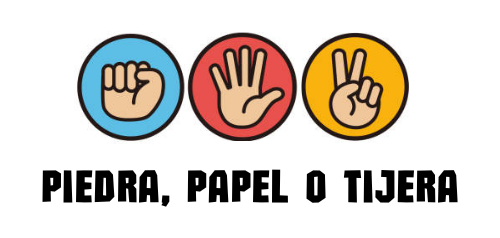
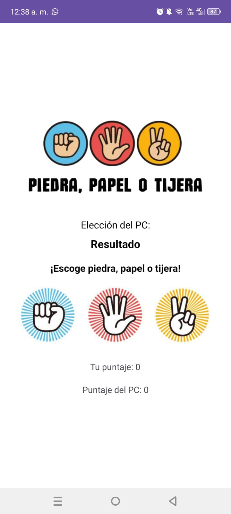

# Piedra, Papel o Tijera

Una aplicación móvil para Android desarrollada en Android Studio que permite a los usuarios jugar el clásico juego de Piedra, Papel o Tijera contra la computadora. ¡Pon a prueba tu suerte y estratégia!

## Características principales
- Interfaz sencilla y fácil de usar.
- Elección aleatoria de la computadora para competir contra el jugador.
- Indicación clara del resultado de cada partida: “Ganaste”, “Perdiste” o “Empate”.
- Contadores de puntuación para el jugador y la computadora.
- Diseñado para dispositivos Android.

## Capturas de pantalla

  
  
  
  

## Instalación
Puedes descargar el archivo APK desde el siguiente enlace:
[Descargar APK](https://drive.google.com/file/d/1BQIDuLagvsUBRF_lNZme0zZ2s57pL73D/view?usp=sharing)

### Reglas del juego:
- Piedra gana a Tijera.
- Tijera gana a Papel.
- Papel gana a Piedra.
- Si ambas selecciones son iguales, es un empate.

## Contacto
Si tienes dudas o sugerencias, no dudes en contactarme en [barreraha@itecsur.edu.ec](barreraha@itecsur.edu.ec) o abrir un issue en este repositorio.

